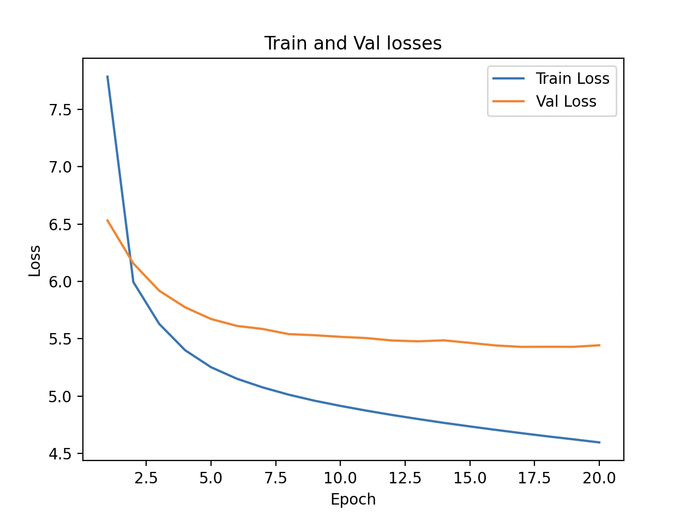

## Objective
The objective of this experiment is to train the model on the following hyperparameters and plot the training loss and validation loss against the epoch.

We use the following hyperparameters -

- **Context Length**: 128
- **Batch Size**: 32
- **Vocab Size**: 40000
- **Embeddings Size**: 256
- **Number of self-attention heads**: 4
- **Number of transformer block layers**: 2
- **Feed Forward Size**: 1024
- **Number of epochs to train**: 20

## Results
Below are the results of this experiment -
```
Num Parameters: 22,132,288
Epoch: 0, Train Loss: 7.7849, Val Loss: 6.5312, Loss Diff: -1.2537
Epoch: 1, Train Loss: 5.9940, Val Loss: 6.1562, Loss Diff: 0.1622
Epoch: 2, Train Loss: 5.6292, Val Loss: 5.9187, Loss Diff: 0.2895
Epoch: 3, Train Loss: 5.4000, Val Loss: 5.7743, Loss Diff: 0.3742
Epoch: 4, Train Loss: 5.2521, Val Loss: 5.6724, Loss Diff: 0.4203
Epoch: 5, Train Loss: 5.1515, Val Loss: 5.6121, Loss Diff: 0.4605
Epoch: 6, Train Loss: 5.0757, Val Loss: 5.5851, Loss Diff: 0.5094
Epoch: 7, Train Loss: 5.0126, Val Loss: 5.5405, Loss Diff: 0.5279
Epoch: 8, Train Loss: 4.9599, Val Loss: 5.5308, Loss Diff: 0.5709
Epoch: 9, Train Loss: 4.9147, Val Loss: 5.5167, Loss Diff: 0.6020
Epoch: 10, Train Loss: 4.8735, Val Loss: 5.5060, Loss Diff: 0.6325
Epoch: 11, Train Loss: 4.8353, Val Loss: 5.4847, Loss Diff: 0.6494
Epoch: 12, Train Loss: 4.8004, Val Loss: 5.4777, Loss Diff: 0.6774
Epoch: 13, Train Loss: 4.7667, Val Loss: 5.4862, Loss Diff: 0.7195
Epoch: 14, Train Loss: 4.7358, Val Loss: 5.4643, Loss Diff: 0.7285
Epoch: 15, Train Loss: 4.7057, Val Loss: 5.4414, Loss Diff: 0.7357
Epoch: 16, Train Loss: 4.6769, Val Loss: 5.4291, Loss Diff: 0.7522
Epoch: 17, Train Loss: 4.6493, Val Loss: 5.4300, Loss Diff: 0.7807
Epoch: 18, Train Loss: 4.6233, Val Loss: 5.4295, Loss Diff: 0.8062
Epoch: 19, Train Loss: 4.5964, Val Loss: 5.4433, Loss Diff: 0.8469
```

## Findings

- There is loss reduction in both training loss and validation loss over the epochs. This is a sign that we are not overfitting.
- Validation loss starts to plateau off towards epoch 14, while training loss continues to decrease. This indicates that the network has learnt what it can, so maybe the network needs to increase in complexity.

Below is the graph of how to loss is trending - 


