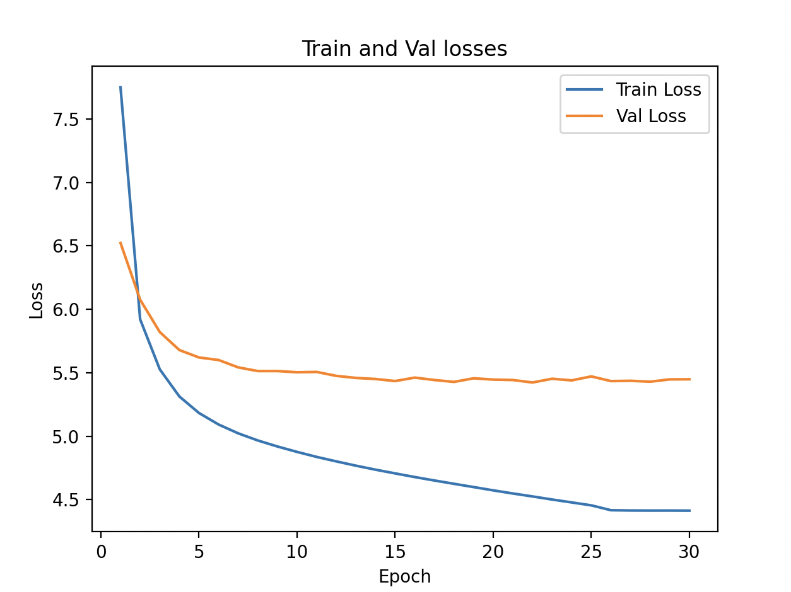

## Objective
After the first experiment, in this experiment, we will try to improve the loss by increasing the model complexity and tuning the learning rate. 

We will do the following things -

- **Increase the model complexity**: Increase the number of tranformer layers from 2 to 4 and increase the number of self attention heads from 4 to 8. (Because we are keeping the number of embeddings same as before to 256, number of attention heads must squarely divide the number of embeddings.)
- **Increase the number of epochs**: From the results of experiment #1, we see that we are not overfitting. As we are also increasing the model complexity, let's train for 30 epochs (as opposed to 20 epochs in experiment #1).
- **Tune the learning rate**: In Experiment #1, we used a learning rate of 1e-4 for 20 epochs. In this experiment, we will use the learning rate if 1e-4 for the first 25 epochs and then use 1e-6 fot the next 5 epochs.

## Hyperparameters
As per the above, we will use the following hyperparameters for this experiment -
- **Context Length**: 128
- **Batch Size**: 32
- **Vocab Size**: 40000
- **Embeddings Size**: 256
- **Number of self-attention heads**: 6
- **Number of transformer block layers**: 4
- **Feed Forward Size**: 1024
- **Number of epochs to train**: 30


We are hoping to get a better training and validation loss as compared to experiment #1.

## Results
Below are the training and validation losses.
```
Num Parameters: 23,711,808
Epoch: 0, LR: 0.0001, Train Loss: 7.7492, Val Loss: 6.5231, Loss Diff: -1.2261
Epoch: 1, LR: 0.0001, Train Loss: 5.9210, Val Loss: 6.0761, Loss Diff: 0.1551
Epoch: 2, LR: 0.0001, Train Loss: 5.5277, Val Loss: 5.8213, Loss Diff: 0.2936
Epoch: 3, LR: 0.0001, Train Loss: 5.3132, Val Loss: 5.6792, Loss Diff: 0.3660
Epoch: 4, LR: 0.0001, Train Loss: 5.1830, Val Loss: 5.6207, Loss Diff: 0.4377
Epoch: 5, LR: 0.0001, Train Loss: 5.0923, Val Loss: 5.6007, Loss Diff: 0.5084
Epoch: 6, LR: 0.0001, Train Loss: 5.0228, Val Loss: 5.5427, Loss Diff: 0.5199
Epoch: 7, LR: 0.0001, Train Loss: 4.9666, Val Loss: 5.5136, Loss Diff: 0.5470
Epoch: 8, LR: 0.0001, Train Loss: 4.9191, Val Loss: 5.5137, Loss Diff: 0.5945
Epoch: 9, LR: 0.0001, Train Loss: 4.8765, Val Loss: 5.5042, Loss Diff: 0.6277
Epoch: 10, LR: 0.0001, Train Loss: 4.8370, Val Loss: 5.5068, Loss Diff: 0.6698
Epoch: 11, LR: 0.0001, Train Loss: 4.8017, Val Loss: 5.4756, Loss Diff: 0.6739
Epoch: 12, LR: 0.0001, Train Loss: 4.7680, Val Loss: 5.4596, Loss Diff: 0.6916
Epoch: 13, LR: 0.0001, Train Loss: 4.7364, Val Loss: 5.4511, Loss Diff: 0.7147
Epoch: 14, LR: 0.0001, Train Loss: 4.7071, Val Loss: 5.4348, Loss Diff: 0.7277
Epoch: 15, LR: 0.0001, Train Loss: 4.6784, Val Loss: 5.4621, Loss Diff: 0.7837
Epoch: 16, LR: 0.0001, Train Loss: 4.6512, Val Loss: 5.4430, Loss Diff: 0.7918
Epoch: 17, LR: 0.0001, Train Loss: 4.6251, Val Loss: 5.4282, Loss Diff: 0.8031
Epoch: 18, LR: 0.0001, Train Loss: 4.5994, Val Loss: 5.4565, Loss Diff: 0.8571
Epoch: 19, LR: 0.0001, Train Loss: 4.5734, Val Loss: 5.4466, Loss Diff: 0.8732
Epoch: 20, LR: 0.0001, Train Loss: 4.5488, Val Loss: 5.4430, Loss Diff: 0.8942
Epoch: 21, LR: 0.0001, Train Loss: 4.5255, Val Loss: 5.4235, Loss Diff: 0.8980
Epoch: 22, LR: 0.0001, Train Loss: 4.5012, Val Loss: 5.4530, Loss Diff: 0.9517
Epoch: 23, LR: 0.0001, Train Loss: 4.4784, Val Loss: 5.4402, Loss Diff: 0.9618
Epoch: 24, LR: 0.0001, Train Loss: 4.4552, Val Loss: 5.4715, Loss Diff: 1.0163
Epoch: 25, LR: 1.0000000000000002e-06, Train Loss: 4.4170, Val Loss: 5.4346, Loss Diff: 1.0176
Epoch: 26, LR: 1.0000000000000002e-06, Train Loss: 4.4148, Val Loss: 5.4369, Loss Diff: 1.0222
Epoch: 27, LR: 1.0000000000000002e-06, Train Loss: 4.4142, Val Loss: 5.4299, Loss Diff: 1.0157
Epoch: 28, LR: 1.0000000000000002e-06, Train Loss: 4.4143, Val Loss: 5.4481, Loss Diff: 1.0338
Epoch: 29, LR: 1.0000000000000002e-06, Train Loss: 4.4137, Val Loss: 5.4489, Loss Diff: 1.0353
```

## Findings

Below is the graph of how the losses are trending - 

- We see that the validation loss has remained almost the same from the first experiment. So, the increased model complexity has not helped.
- The gap between the training loss and the validation loss starts to increase suggesting overfitting, especially towards the later epochs. So, increasing the number of epochs has not helped. 


