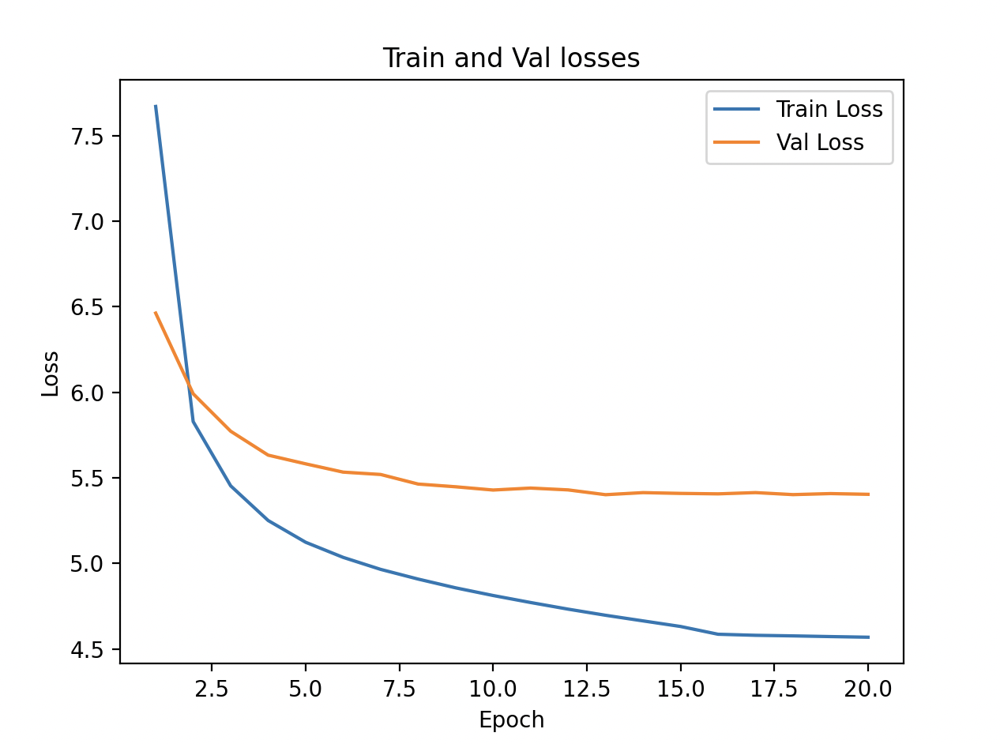

## Experiment
From the previous experiment, we saw that increasing the model complexity by increasing the number of layers and increasing the number of self-attention heads did not help significantly.

In this experiment, let's try increasing the model complexity by increasing the dimensionality of the feed forward layers. This might help in representing higher dimensional data.

We also saw from the previous experiment that towards the later epochs, the validation loss slightly starts to increase and hence maybe indicating overfitting (but barely). We also see very less improvement after epoch 20. So, in this experiment we will train for 20 epochs.

We will do the following - 

- **Increase the feed-forward layer** - Increase the feed-forward layer from 1024 to 2048.

## Hyperparamters
As per the above, we will use the following hyperparameters for this experiment - 
- **Context Length**: 128
- **Batch Size**: 32
- **Vocab Size**: 40000
- **Embeddings Size**: 256
- **Number of self-attention heads**: 6
- **Number of transformer block layers**: 4
- **Feed Forward Size**: 2048
- **Number of epochs to train**: 20

## Results
Below are the training and validation losses.
```
Num Parameters: 25,813,056
Epoch: 0, LR: 0.0001, Train Loss: 7.6700, Val Loss: 6.4625, Loss Diff: -1.2075
Epoch: 1, LR: 0.0001, Train Loss: 5.8287, Val Loss: 5.9913, Loss Diff: 0.1626
Epoch: 2, LR: 0.0001, Train Loss: 5.4533, Val Loss: 5.7724, Loss Diff: 0.3191
Epoch: 3, LR: 0.0001, Train Loss: 5.2507, Val Loss: 5.6326, Loss Diff: 0.3819
Epoch: 4, LR: 0.0001, Train Loss: 5.1236, Val Loss: 5.5818, Loss Diff: 0.4582
Epoch: 5, LR: 0.0001, Train Loss: 5.0353, Val Loss: 5.5334, Loss Diff: 0.4981
Epoch: 6, LR: 0.0001, Train Loss: 4.9651, Val Loss: 5.5196, Loss Diff: 0.5545
Epoch: 7, LR: 0.0001, Train Loss: 4.9085, Val Loss: 5.4637, Loss Diff: 0.5552
Epoch: 8, LR: 0.0001, Train Loss: 4.8573, Val Loss: 5.4478, Loss Diff: 0.5905
Epoch: 9, LR: 0.0001, Train Loss: 4.8125, Val Loss: 5.4287, Loss Diff: 0.6162
Epoch: 10, LR: 0.0001, Train Loss: 4.7715, Val Loss: 5.4402, Loss Diff: 0.6687
Epoch: 11, LR: 0.0001, Train Loss: 4.7328, Val Loss: 5.4295, Loss Diff: 0.6968
Epoch: 12, LR: 0.0001, Train Loss: 4.6970, Val Loss: 5.4015, Loss Diff: 0.7045
Epoch: 13, LR: 0.0001, Train Loss: 4.6641, Val Loss: 5.4136, Loss Diff: 0.7495
Epoch: 14, LR: 0.0001, Train Loss: 4.6315, Val Loss: 5.4091, Loss Diff: 0.7776
Epoch: 15, LR: 1e-05, Train Loss: 4.5861, Val Loss: 5.4064, Loss Diff: 0.8203
Epoch: 16, LR: 1e-05, Train Loss: 4.5799, Val Loss: 5.4138, Loss Diff: 0.8338
Epoch: 17, LR: 1e-05, Train Loss: 4.5765, Val Loss: 5.4020, Loss Diff: 0.8254
Epoch: 18, LR: 1e-05, Train Loss: 4.5724, Val Loss: 5.4080, Loss Diff: 0.8355
Epoch: 19, LR: 1e-05, Train Loss: 4.5687, Val Loss: 5.4037, Loss Diff: 0.8350
```

## Findings

As compared to previous experiment, we see the following - 

- **Initial losses**: The initial training and validation loss starts off better in this experiment.
- **Validation loss**: We end up with a slightly lower validation loss in this case as compared with previous experiments.
- **Loss Rate** - Both training and validation losses trend towards decreasing, so not indicating any overfitting yet.

This indicates that there is still some juice in making the network more complex. So, we will try making the model a little more complex in the next experiment as well.

Following is the loss graph - 

