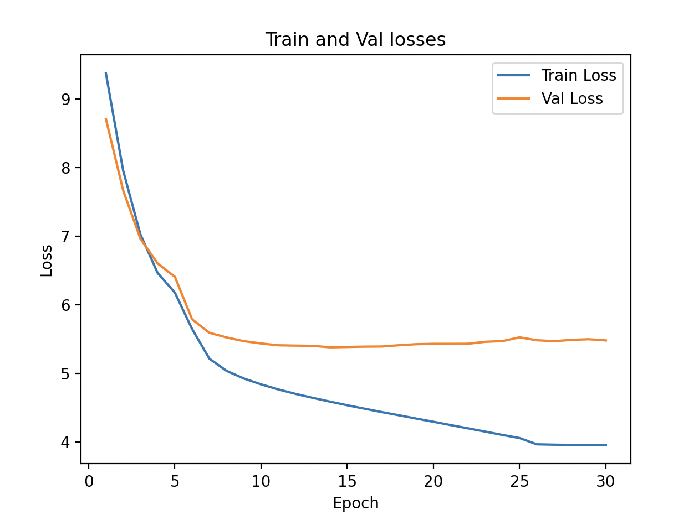

## Objective
In the last experiment, we saw that increasing the feed forward size help a little. Let's now increase the model complexity by increasing the embedding size (to try to more effectively represent the input) and play with the learning rate a bit.

We will do the following things - 

- **Increase Embedding Size**: Let's increase the embedding size from 256 to 512.
- **Learning Rate Warmup**: We generally trained at 1e-4 and then decreased to 1e-6 in later epochs in the previous experiment(s). In this experiment, let's start with a learning rate of 1e-5 for the first 5 epochs, then do the learning rate of 1e-4 for 20 epochs, and then finish the last 5 epochs with a learning rate of 1e-6. 
- **Change number of epochs**: Because we are trying with 3 different learning rates, let's train for 30 epochs to give space to different learning rates.

## Hyperparameters
As per the above, we will use the following hyperparameters for this experiment -
- **Context Length**: 128
- **Batch Size**: 32
- **Vocab Size**: 40000
- **Embeddings Size**: 512
- **Number of self-attention heads**: 8
- **Number of transformer block layers**: 4
- **Feed Forward Size**: 2048
- **Number of epochs to train**: 30

## Results
Following are the training and valiation losses - 
```
Num Parameters: 53,675,072
Epoch: 0, LR: 1e-05, Train Loss: 9.3715, Val Loss: 8.7064, Loss Diff: -0.6650
Epoch: 1, LR: 1e-05, Train Loss: 7.9552, Val Loss: 7.6661, Loss Diff: -0.2891
Epoch: 2, LR: 1e-05, Train Loss: 7.0257, Val Loss: 6.9628, Loss Diff: -0.0629
Epoch: 3, LR: 1e-05, Train Loss: 6.4627, Val Loss: 6.6011, Loss Diff: 0.1384
Epoch: 4, LR: 1e-05, Train Loss: 6.1766, Val Loss: 6.4079, Loss Diff: 0.2312
Epoch: 5, LR: 0.0001, Train Loss: 5.6457, Val Loss: 5.7872, Loss Diff: 0.1414
Epoch: 6, LR: 0.0001, Train Loss: 5.2147, Val Loss: 5.5913, Loss Diff: 0.3766
Epoch: 7, LR: 0.0001, Train Loss: 5.0360, Val Loss: 5.5238, Loss Diff: 0.4878
Epoch: 8, LR: 0.0001, Train Loss: 4.9255, Val Loss: 5.4698, Loss Diff: 0.5443
Epoch: 9, LR: 0.0001, Train Loss: 4.8400, Val Loss: 5.4360, Loss Diff: 0.5960
Epoch: 10, LR: 0.0001, Train Loss: 4.7662, Val Loss: 5.4092, Loss Diff: 0.6430
Epoch: 11, LR: 0.0001, Train Loss: 4.7012, Val Loss: 5.4045, Loss Diff: 0.7033
Epoch: 12, LR: 0.0001, Train Loss: 4.6430, Val Loss: 5.4010, Loss Diff: 0.7579
Epoch: 13, LR: 0.0001, Train Loss: 4.5882, Val Loss: 5.3799, Loss Diff: 0.7916
Epoch: 14, LR: 0.0001, Train Loss: 4.5351, Val Loss: 5.3846, Loss Diff: 0.8495
Epoch: 15, LR: 0.0001, Train Loss: 4.4853, Val Loss: 5.3894, Loss Diff: 0.9041
Epoch: 16, LR: 0.0001, Train Loss: 4.4360, Val Loss: 5.3913, Loss Diff: 0.9553
Epoch: 17, LR: 0.0001, Train Loss: 4.3889, Val Loss: 5.4099, Loss Diff: 1.0210
Epoch: 18, LR: 0.0001, Train Loss: 4.3408, Val Loss: 5.4253, Loss Diff: 1.0844
Epoch: 19, LR: 0.0001, Train Loss: 4.2942, Val Loss: 5.4303, Loss Diff: 1.1361
Epoch: 20, LR: 0.0001, Train Loss: 4.2458, Val Loss: 5.4304, Loss Diff: 1.1846
Epoch: 21, LR: 0.0001, Train Loss: 4.1987, Val Loss: 5.4315, Loss Diff: 1.2328
Epoch: 22, LR: 0.0001, Train Loss: 4.1512, Val Loss: 5.4602, Loss Diff: 1.3090
Epoch: 23, LR: 0.0001, Train Loss: 4.1026, Val Loss: 5.4703, Loss Diff: 1.3677
Epoch: 24, LR: 0.0001, Train Loss: 4.0569, Val Loss: 5.5251, Loss Diff: 1.4682
Epoch: 25, LR: 1.0000000000000002e-06, Train Loss: 3.9657, Val Loss: 5.4826, Loss Diff: 1.5168
Epoch: 26, LR: 1.0000000000000002e-06, Train Loss: 3.9606, Val Loss: 5.4694, Loss Diff: 1.5088
Epoch: 27, LR: 1.0000000000000002e-06, Train Loss: 3.9568, Val Loss: 5.4878, Loss Diff: 1.5310
Epoch: 28, LR: 1.0000000000000002e-06, Train Loss: 3.9545, Val Loss: 5.4975, Loss Diff: 1.5430
Epoch: 29, LR: 1.0000000000000002e-06, Train Loss: 3.9527, Val Loss: 5.4802, Loss Diff: 1.5274
```

## Findings
As compared to the previous experiment, we see the following - 

- **Validation Losses**: We don't see a improvement in the validation loss from the last experiment. Though, the training loss continues to decrease, the validation loss remains moreor less constant since epoch 10. This indicates that the network is not generalizing.
- **Overfitting**: The difference between train loss and validation loss is higher (~1.5). This shows that the more complex model has the capacity to learn more (shown by decreasing training loss), but, because validation loss is not increasing, it might be overfitting.

This might be indicating that the input is becoming a constraint now, so we may experiment with increasing the context length.

The training and validation losses are also depicted in the graph below - 

