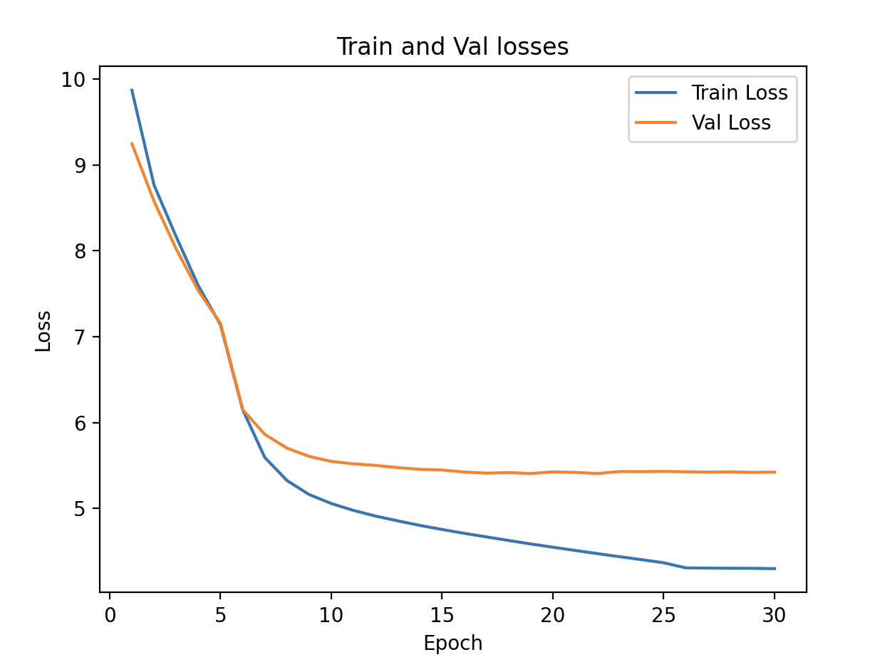

## Objective
We did not see any improvement by making the model bigger in the last experiment. However, training loss continued to decrease indicating that the model has the capacity to learn, but not generalizing. To see whether the model can generalize better, we may increase the context length.

## Hyperparameters
We will run this experiment with the following hyperparameters - 
- **Context Length**: 256
- **Batch Size**: 32
- **Vocab Size**: 40000
- **Embeddings Size**: 512
- **Number of self-attention heads**: 8
- **Number of transformer block layers**: 4
- **Feed Forward Size**: 2048
- **Number of epochs to train**: 30

## Results
Below are the training and validation losses -
```
Num Parameters: 53,740,608
Epoch: 0, LR: 1e-05, Train Loss: 9.8728, Val Loss: 9.2490, Loss Diff: -0.6237
Epoch: 1, LR: 1e-05, Train Loss: 8.7676, Val Loss: 8.5788, Loss Diff: -0.1888
Epoch: 2, LR: 1e-05, Train Loss: 8.1645, Val Loss: 8.0227, Loss Diff: -0.1418
Epoch: 3, LR: 1e-05, Train Loss: 7.5935, Val Loss: 7.5354, Loss Diff: -0.0580
Epoch: 4, LR: 1e-05, Train Loss: 7.1385, Val Loss: 7.1553, Loss Diff: 0.0169
Epoch: 5, LR: 0.0001, Train Loss: 6.1484, Val Loss: 6.1498, Loss Diff: 0.0014
Epoch: 6, LR: 0.0001, Train Loss: 5.5918, Val Loss: 5.8616, Loss Diff: 0.2698
Epoch: 7, LR: 0.0001, Train Loss: 5.3232, Val Loss: 5.7009, Loss Diff: 0.3777
Epoch: 8, LR: 0.0001, Train Loss: 5.1601, Val Loss: 5.6048, Loss Diff: 0.4447
Epoch: 9, LR: 0.0001, Train Loss: 5.0555, Val Loss: 5.5463, Loss Diff: 0.4908
Epoch: 10, LR: 0.0001, Train Loss: 4.9753, Val Loss: 5.5182, Loss Diff: 0.5429
Epoch: 11, LR: 0.0001, Train Loss: 4.9087, Val Loss: 5.4998, Loss Diff: 0.5911
Epoch: 12, LR: 0.0001, Train Loss: 4.8533, Val Loss: 5.4742, Loss Diff: 0.6209
Epoch: 13, LR: 0.0001, Train Loss: 4.8002, Val Loss: 5.4537, Loss Diff: 0.6536
Epoch: 14, LR: 0.0001, Train Loss: 4.7530, Val Loss: 5.4463, Loss Diff: 0.6933
Epoch: 15, LR: 0.0001, Train Loss: 4.7079, Val Loss: 5.4224, Loss Diff: 0.7145
Epoch: 16, LR: 0.0001, Train Loss: 4.6664, Val Loss: 5.4098, Loss Diff: 0.7434
Epoch: 17, LR: 0.0001, Train Loss: 4.6249, Val Loss: 5.4161, Loss Diff: 0.7912
Epoch: 18, LR: 0.0001, Train Loss: 4.5842, Val Loss: 5.4048, Loss Diff: 0.8206
Epoch: 19, LR: 0.0001, Train Loss: 4.5462, Val Loss: 5.4245, Loss Diff: 0.8783
Epoch: 20, LR: 0.0001, Train Loss: 4.5085, Val Loss: 5.4188, Loss Diff: 0.9104
Epoch: 21, LR: 0.0001, Train Loss: 4.4718, Val Loss: 5.4049, Loss Diff: 0.9330
Epoch: 22, LR: 0.0001, Train Loss: 4.4359, Val Loss: 5.4282, Loss Diff: 0.9924
Epoch: 23, LR: 0.0001, Train Loss: 4.4011, Val Loss: 5.4269, Loss Diff: 1.0258
Epoch: 24, LR: 0.0001, Train Loss: 4.3648, Val Loss: 5.4296, Loss Diff: 1.0649
Epoch: 25, LR: 1.0000000000000002e-06, Train Loss: 4.3055, Val Loss: 5.4255, Loss Diff: 1.1200
Epoch: 26, LR: 1.0000000000000002e-06, Train Loss: 4.3026, Val Loss: 5.4217, Loss Diff: 1.1191
Epoch: 27, LR: 1.0000000000000002e-06, Train Loss: 4.3009, Val Loss: 5.4250, Loss Diff: 1.1242
Epoch: 28, LR: 1.0000000000000002e-06, Train Loss: 4.3003, Val Loss: 5.4187, Loss Diff: 1.1185
Epoch: 29, LR: 1.0000000000000002e-06, Train Loss: 4.2967, Val Loss: 5.4219, Loss Diff: 1.1252
```

The following graph depicts the training and the validation losses.

