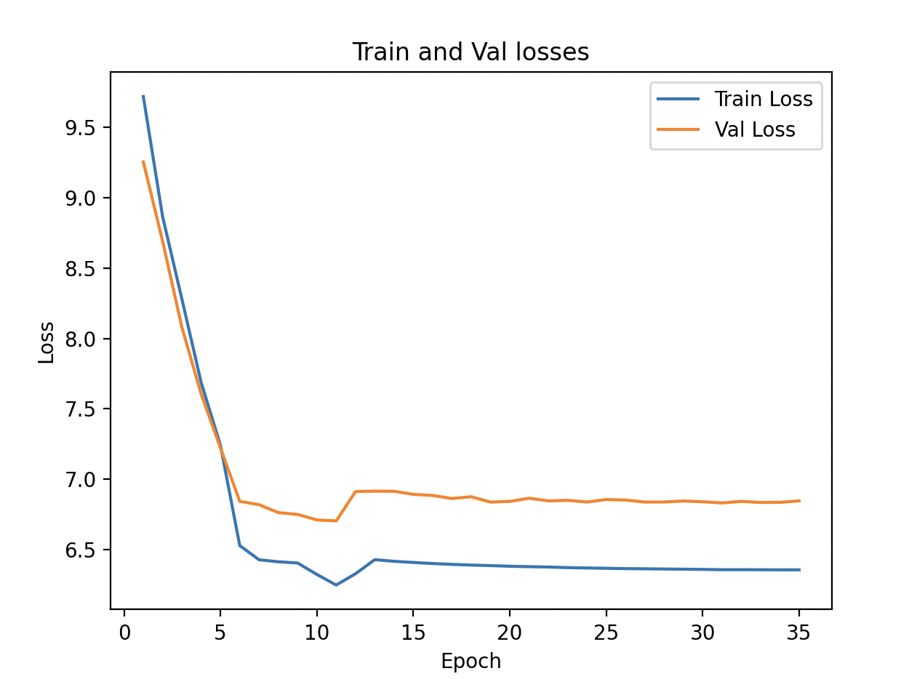

## Objective
From the previous experiments, we saw very small improvements. In this experiments, let's try multiple things at once to bump up improvements. We will try the following things - 

#### Increase model complexity
Let's increase the model complexity so that the model learns more complex patterns in the data. To do this, let's tune the following hyperparameters - 
- **Increase the number of transformer layers** from `4` to `8` so that we add depth to capture more complex patterns.
- **Increase the feed-forward size** to `4096`, so that the model again learns more deeply.

#### Learning Rate scheduling
Let's also experiment with learning rate scheduling. Let's do the following things - 
- Like previous experiments, we will start warming up the learning rate from 1e-5 for the first 5 epochs, but with **cosine annealing**.
- Then, we will increase the learning rate to 5e-4 (from previously of 1e-4) so that the model can converge a little faster than before.
- Then, we will use **cosine annealing** to decay the learning rate more smoothly rather than abruptly changing it.

#### Dropout
To bring in a little more regularization, let's increase the dropout to `0.3`.

#### Layer Drop
To bring in more regularization, probabilitistically drop some layers from the tranformer layers during training. Let's set this probability to `0.1`.

#### Number of epochs
Due to the introduction of cosine annealing, we can increase the number of epochs to 35.

## Results
Below are the training and validation losses - 
```
Num Parameters: 46,382,656
Epoch: 0, LR: 1e-05, Train Loss: 9.7173, Val Loss: 9.2531, Loss Diff: -0.4642
Epoch: 1, LR: 1e-05, Train Loss: 8.8651, Val Loss: 8.6900, Loss Diff: -0.1751
Epoch: 2, LR: 1e-05, Train Loss: 8.2790, Val Loss: 8.0788, Loss Diff: -0.2002
Epoch: 3, LR: 1e-05, Train Loss: 7.6863, Val Loss: 7.6046, Loss Diff: -0.0817
Epoch: 4, LR: 1e-05, Train Loss: 7.2408, Val Loss: 7.2221, Loss Diff: -0.0186
Epoch: 5, LR: 0.0005, Train Loss: 6.5290, Val Loss: 6.8433, Loss Diff: 0.3143
Epoch: 6, LR: 0.0005, Train Loss: 6.4284, Val Loss: 6.8195, Loss Diff: 0.3911
Epoch: 7, LR: 0.0005, Train Loss: 6.4142, Val Loss: 6.7633, Loss Diff: 0.3491
Epoch: 8, LR: 0.0005, Train Loss: 6.4055, Val Loss: 6.7506, Loss Diff: 0.3451
Epoch: 9, LR: 0.0005, Train Loss: 6.3241, Val Loss: 6.7113, Loss Diff: 0.3872
Epoch: 10, LR: 0.0001, Train Loss: 6.2488, Val Loss: 6.7044, Loss Diff: 0.4556
Epoch: 11, LR: 0.0004921614987015934, Train Loss: 6.3293, Val Loss: 6.9125, Loss Diff: 0.5832
Epoch: 12, LR: 0.0004824792332291187, Train Loss: 6.4292, Val Loss: 6.9158, Loss Diff: 0.4866
Epoch: 13, LR: 0.00046913851667094395, Train Loss: 6.4176, Val Loss: 6.9145, Loss Diff: 0.4969
Epoch: 14, LR: 0.00045234974009654937, Train Loss: 6.4093, Val Loss: 6.8928, Loss Diff: 0.4835
Epoch: 15, LR: 0.0004323776725416422, Train Loss: 6.4018, Val Loss: 6.8852, Loss Diff: 0.4834
Epoch: 16, LR: 0.0004095372854422982, Train Loss: 6.3958, Val Loss: 6.8631, Loss Diff: 0.4673
Epoch: 17, LR: 0.00038418878534725965, Train Loss: 6.3907, Val Loss: 6.8762, Loss Diff: 0.4855
Epoch: 18, LR: 0.00035673193324548566, Train Loss: 6.3871, Val Loss: 6.8378, Loss Diff: 0.4507
Epoch: 19, LR: 0.0003275997400965494, Train Loss: 6.3825, Val Loss: 6.8426, Loss Diff: 0.4601
Epoch: 20, LR: 0.00029725163798913836, Train Loss: 6.3794, Val Loss: 6.8655, Loss Diff: 0.4861
Epoch: 21, LR: 0.00026616623462256375, Train Loss: 6.3769, Val Loss: 6.8466, Loss Diff: 0.4697
Epoch: 22, LR: 0.0002348337653774363, Train Loss: 6.3727, Val Loss: 6.8507, Loss Diff: 0.4780
Epoch: 23, LR: 0.0002037483620108617, Train Loss: 6.3702, Val Loss: 6.8384, Loss Diff: 0.4682
Epoch: 24, LR: 0.0001734002599034507, Train Loss: 6.3680, Val Loss: 6.8560, Loss Diff: 0.4880
Epoch: 25, LR: 0.00014426806675451437, Train Loss: 6.3655, Val Loss: 6.8524, Loss Diff: 0.4868
Epoch: 26, LR: 0.00011681121465274027, Train Loss: 6.3644, Val Loss: 6.8384, Loss Diff: 0.4740
Epoch: 27, LR: 9.146271455770191e-05, Train Loss: 6.3629, Val Loss: 6.8386, Loss Diff: 0.4757
Epoch: 28, LR: 6.862232745835787e-05, Train Loss: 6.3615, Val Loss: 6.8457, Loss Diff: 0.4841
Epoch: 29, LR: 4.865025990345063e-05, Train Loss: 6.3601, Val Loss: 6.8402, Loss Diff: 0.4801
Epoch: 30, LR: 3.186148332905603e-05, Train Loss: 6.3581, Val Loss: 6.8320, Loss Diff: 0.4740
Epoch: 31, LR: 1.8520766770881288e-05, Train Loss: 6.3581, Val Loss: 6.8430, Loss Diff: 0.4849
Epoch: 32, LR: 8.838501298406575e-06, Train Loss: 6.3576, Val Loss: 6.8353, Loss Diff: 0.4777
Epoch: 33, LR: 2.967382022037798e-06, Train Loss: 6.3570, Val Loss: 6.8362, Loss Diff: 0.4792
Epoch: 34, LR: 1e-06, Train Loss: 6.3571, Val Loss: 6.8464, Loss Diff: 0.4893
```

The following graph depicts the training and validation losses.


## Findings
There are good and bad things in this result - 

- Both the training and validation losses are higher than other experiments. So, it seems that the neural network will take longer to converge given the higher complexity of the network.
- The training seems to be more stabilised, but this can be attributed to lower learning rates. 
- The difference between the training and validation losses are not lower than the previous experiments at the same training loss.

Overall, the inreased complexity and increased computational requirements have not helped much. From this, it feels like for the training dataset of 9 books is too low for the neural network to learn.